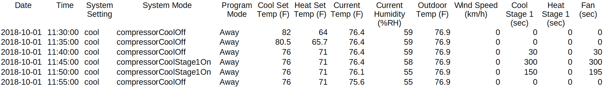

README

# Series Introduction

This opens a series of articles using smart thermostat data from my home to seek a data-driven understanding of home energy performance and control.  While the Nest devices seem to be the best-known smart thermostats, my home is installed with two [ecobee4](https://www.ecobee.com/ecobee4/) thermostats, each controlling a separate HVAC system (one system for upstairs and one for downstairs, in a 1700-ft2 townhouse in Austin, TX).  

At the end of this article, I'll introduce the data available from the ecobee devices and the kinds of questions to be investigated.  

* INSERT HERE:  why this analysis?  What will be enabled?  i.e., use cases
 
However, most of this initial article discusses the alternative to a data-driven study:  traditional energy-balance analysis [BETTER TERM]?  As the data-driven analysis is developed and assessed, we'll compare the two approaches on ease of use, power of results, and general applicability.  

# Traditional Building Energy Analysis
## Modes of heat transfer
* Conduction, i.e, heat exchanged with the ground under the house
* Convection
    * Between walls/roof and moving air
    * Air conditioning
* Radiaton
	* Direct insolation
    * Terrestrial exchange (radiation between walls and surrounding terrain)
* Mass exchange, i.e., air leakage

All the modes of heat transfer occur at rates that vary continuously with temperature difference between the building materials or interior airspace and the surrounding environment (even the temperature of the sun!).  Therefore, there is some building temperature at which an equilibrium occurs.  When below equilibrium temperature, the building will gain heat; when above equilibrium temperature, the building will lose heat. 

This is complicated by external conditions changing over time:  outdoor air temperature, wind speed and direction, changes in solar radiation due to time of day and cloud cover, building occupancy and usage, and heating and cooling delivered by building HVAC systems.  Therefore, the building is constantly evolving towards an instantaneous equilibrium that changes over time, as if it were Wile E. Coyote always chasing directly towards an ever-moving Road Runner.

One way to address this problem is to write a system of simultaneous equations describing all the interactions occurring at each building boundary under the steady-state external conditions associated with some short interval of the day (e.g., an hour or a five-minute period)...

* Convection for each wall, and the roof
* Conduction through each wall and the roof
* Radiation exchange at exterior surface of each wall and the roof
* Conduction to ground
* Convection between the interior airspace and each interior wall surface
* Radiation between interior wall surfaces
* Air exchange, i.e., leakage

and solve the system of equations in each period for a sequence of steady-state indoor air temperatures throughout the day 

Another view of this would be to add a term for the rate of heating or cooling energy input (often called the heating or cooling "load") and solve the system of equations for the value of the HVAC load value that will achieve an equilibrium indoor air temperature matching a comfort target, i.e., the thermostat setpoint.

Complications (beyond a simple box at equilibrium):
* Time-dependence, i.e., hysteresis, via building envelope materials
* Effects of varying humidity and its effect on comfort
* Building construction (e.g., wall framing and cavities, attic spaces, interior room configurations)

## Simulation
In practice, a professional energy engineer would more typically employ Building Energy Simulation software such as [eQuest](http://www.doe2.com/equest/) or DOE2.  These programs have been developed over many users by government, academic, and industry researchers to represent the building as a set of physical and mechanical components (e.g., walls, roof, room layouts, HVAC systems including ducts, coolant loops, fans, steam or hot water loops) and their dimensions, materials, and physical properties.  Extensive sets of templates are available to represent standard types of construction and materials.  eQuest models are built through a graphical interface, while DOE2 is essentially text-based modeling language.The software supplies enormous capabilities to the modeler in handling many of the complications described above, including solar and weather profiles by location and date (including variability), all the heat transfer modeling between different physical components and spaces, period-by-period dependencies, and computing extensive data and statistics on energy-related quantities of interest (heat gains and losses per surface per period, overall energy usage, interior temperatures, etc.).However, "garbage in, garbage out" still applies.  If the building model designed in the simulation doesn't reflect the building's true construction and usage, the simulation outputs won't reflect the actual conditions that can be expected over time.  

Specific difficulties include
* For an existing building:

	* Knowing the actual construction properties of the physical envelope (you can't necessarily look inside the walls to see the framing, insulation type, stud dimensions, etc.)
	* Knowing the leakage rate in Air Changes per Hour -- a building's ACH is difficult to measure accurately under static conditions, and can vary significantly due to wind speed and other factors
* For a building being designed for construction:
	* Building designs are often a moving target due to value engineering
	* Buildings are often not built exactly as designed, and the building as built may perform quite differently from the building as designed
		* This is especially true for leakage

# The alternative:  data-driven modeling
The primary data available for download from the account for an ecobee thermostat looks like:

For each five-minute period, we know:
* how many seconds of heating or cooling runtime took place
* the thermostat setpoint for whichever mode (heating or cooling) may be in operation
* room air temperature and humidity as measured by the thermostat
* the number of seconds out of 300 when the thremostat was calling for heating or cooling in order to have the room meet the setpoint temperature

The outdoor temperature and wind speed (DELETE) are from some internet source of localized weather data; we will replace this data from other public domain sources of comparable information.Overall, this is a wealth: 
Smart Meter data?   512-494-9400
